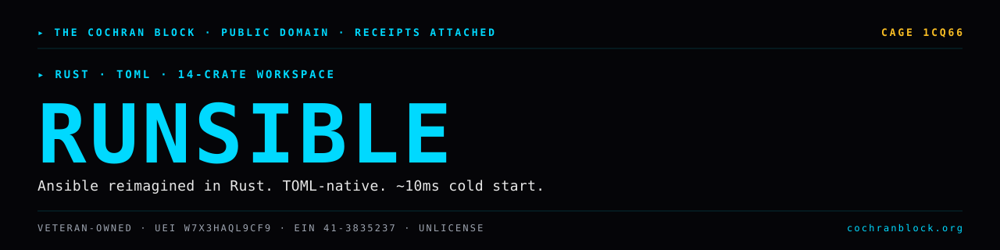

<!-- COCHRANBLOCK-BRAND-HEADER:START - generated by cochranblock/scripts/brand-stamp.sh -->
<picture>
  <source media="(prefers-color-scheme: dark)" srcset="assets/brand/banner.svg">
  <source media="(prefers-color-scheme: light)" srcset="assets/brand/banner.svg">
  
</picture>

[](https://unlicense.org)
[](https://www.rust-lang.org)
[](https://cochranblock.org)
[](https://cochranblock.org)

> &#9656; **RUST** &#183; **TOML** &#183; **14-CRATE WORKSPACE**
<!-- COCHRANBLOCK-BRAND-HEADER:END -->


# runsible

**A 1-for-1 Rust reimagining of Ansible.**

TOML-native, Unlicense, with an automatic YAML to TOML converter so existing Ansible playbooks port cleanly. Pre-alpha — scaffolding only, not usable yet.

---

## Documentation

This README is the entry point. The actual docs live in two source-of-truth files at the root of the repo:

- **[PROOF_OF_ARTIFACTS.md](PROOF_OF_ARTIFACTS.md)** — what exists today, status, source-linked. Build output, 14-crate workspace architecture, binary parity goal, design choices, validation tests, smoke test output, commit log. If you want to know what this project *does*, read this.
- **[TIMELINE_OF_INVENTION.md](TIMELINE_OF_INVENTION.md)** — dated, commit-level record of what was built, when, and why. If you want to know how this project *got built*, read this.

Supporting docs:
- [CONTRIBUTORS.md](CONTRIBUTORS.md) — contributor list
- [WORK.md](WORK.md) — work log

---

## Run It

```bash
cargo build --workspace
cargo test --workspace
./target/debug/runsible-playbook crates/runsible-playbook/examples/hello.toml -i localhost,
./target/debug/runsible-config list
./target/debug/runsible-vault keygen --label test
echo 'http_port: 8080' | ./target/debug/yaml2toml
```

Full build, run, and CLI examples in [PROOF_OF_ARTIFACTS.md](PROOF_OF_ARTIFACTS.md#how-to-verify).

---

## License

Unlicense (public domain). See [UNLICENSE](UNLICENSE).
<!-- COCHRANBLOCK-BRAND-FOOTER:START - generated by cochranblock/scripts/brand-stamp.sh -->

---

<sub>&#9656; **THE COCHRAN BLOCK, LLC** &#183; Veteran-Owned &#183; **CAGE** `1CQ66` &#183; **UEI** `W7X3HAQL9CF9` &#183; **EIN** `41-3835237`</sub>

<sub>&#9656; PUBLIC DOMAIN &#183; UNLICENSE &#183; RECEIPTS ATTACHED &#183; [**cochranblock.org**](https://cochranblock.org) &#183; [github.com/cochranblock](https://github.com/cochranblock)</sub>
<!-- COCHRANBLOCK-BRAND-FOOTER:END -->
